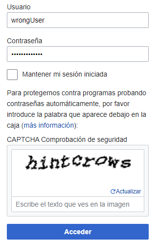

<p align="center">
  <a href="" rel="noopener">
 </a>
</p>
<h3 align="center">Breaking Wikipedia's Captcha</h3>

<div align="center">
    
    
</div>

---

<p align="center"> Breaking 2020 Wikipedia's captcha using image processing and deep learning techniques. Before publishing the project, I sent an email to Wikipedia to make them aware of the vulnerability. I'm <b>not responsible</b> for how this code is used.
    <br> 
</p>

## 👓 Demo

<a href="https://breaking-wikipedia-captcha.herokuapp.com/"></a>


## 🎢 Process

I try to demonstrate how simple image processing techniques and a shallow model like LeNet is enough to break some captcha systems. The project aims to leverage traditional computer vision techniques to train a neural network capable of distinguishing between characters. Before publishing the project, I sent an email to Wikipedia to make them aware of the vulnerability. I’m not responsible for how this code is used.

### 1. **Collect** some random captcha images from Wikipedia
After so many failed attempts to log-in, you are displayed with a captcha image. Each captcha image has 9 or 10 characters. I collected 230 images, so I would have at least 9x230=2070 character images.

<div align="center">

</div>

### 2. **Extract** the characters from the images and label them
Once I had the images, I applied some traditional Computer Vision techniques:

- Binarization (OTSU and manual) to improve the quality of the characters
- Contours to find and extract the characters individually
- Masks to merge to characters together (the dot of the “i” and the vertical line)
- I also had to consider the characters that don’t have any space between them and are detected as a single one.
- All the characters are saved in the corresponding folder inside of the dataset directory after manually labeling them.

### 3. **Train** and fine-tune the neural network
I used the individual character images with size 28x28 to train a LeNet model. The model achieved 96% accuracy with 24 classes and only 20 epochs. I also used momentum to make it converge quicker.

### 4. **Test** it
With new captcha images, the individual characters are extracted, and then I use the already trained model to predict the text. You can see a working demo here.

## 📄 Results

<a href="https://pauladj.github.io/blog/breaking-wikipedia-captcha/"></a>

I used the LeNet architecture, first introduced by LeCun et al. in their 1998 paper, *Gradient-Based Learning Applied to Document Recognition*. The authors' motivation for the implementation of LeNet was primarily for Optical Character Recognition (OCR). It's a simple model with only two convolutional layers. I achieved 96% accuracy and 0.15 loss both on the train and the test set.

<div align="center">

</div>


## 🔧 Setup 
```bash
git clone https://github.com/pauladj/ml-breaking-wikipedia-captcha.git
cd ml-breaking-wikipedia-captcha
pip install -r requirements.txt
```


## 🎈 Usage 
You can use the already downloaded captchas in the `downloads` folder or you can download more images using:

```bash
python download_images.py --output <captcha_image_folder> -n <num_images_to_download>
```

To get the text of the new captcha images you just have to execute the next command:

```bash
python test_model.py --input <captcha_image_folder> --model output
```

## ⛏️ Built Using 
- [OpenCV](https://opencv.org/) - Computer vision library
- [Keras](https://keras.io/) - Deep learning library
- [Streamlit](https://www.streamlit.io/) - Deploy data apps

## 🎉 Acknowledgements 
- Inspired by Adrian Rosebrock's book *Deep Learning for Computer Vision with Python (Starter Bundle)*
