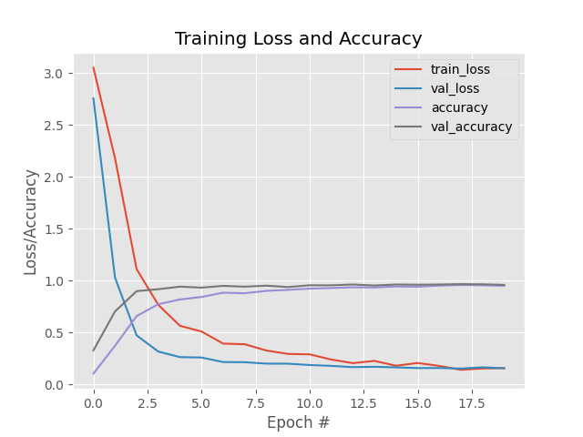

<p align="center">
  <a href="" rel="noopener">
 </a>
</p>
<h3 align="center">Breaking Wikipedia's Captcha</h3>

<div align="center">
    
    
</div>

---

<p align="center"> Breaking 2020 Wikipedia's captcha using image processing and deep learning techniques. Before publishing the project, I sent an email to Wikipedia to make them aware of the vulnerability. I'm <b>not responsible</b> for how this code is used.
    <br> 
</p>

## 👓 Demo

<a href="https://breaking-wikipedia-captcha.herokuapp.com/"></a>


## 📄 Results

I used the LeNet architecture, first introduced by LeCun et al. in their 1998 paper, *Gradient-Based Learning Applied to Document Recognition*. The authors' motivation for the implementation of LeNet was primarily for Optical Character Recognition (OCR). It's a simple model with only two convolutional layers. I achieved 96% accuracy and 0.15 loss both on the train and the test set.

<div align="center">

</div>


## 🔧 Setup 
```bash
git clone https://github.com/pauladj/breaking-wikipedia-captcha.git
cd breaking-wikipedia-captcha
pip install -r requirements.txt
```


## 🎈 Usage 
You can use the already downloaded captchas in the `downloads` folder or you can download more images using:

```bash
python download_images.py --output captcha_image_folder -n num_images_to_download
```

To get the text of the captcha images you just have to execute the next command:

```bash
python test_model.py --input captcha_image_folder --model output
```

## ⛏️ Built Using 
- [OpenCV](https://opencv.org/) - Computer vision library
- [Keras](https://keras.io/) - Deep learning library
- [Streamlit](https://www.streamlit.io/) - Deploy data apps

## 🎉 Acknowledgements 
- Inspired by Adrian Rosebrock's book *Deep Learning for Computer Vision with Python (Starter Bundle)*
